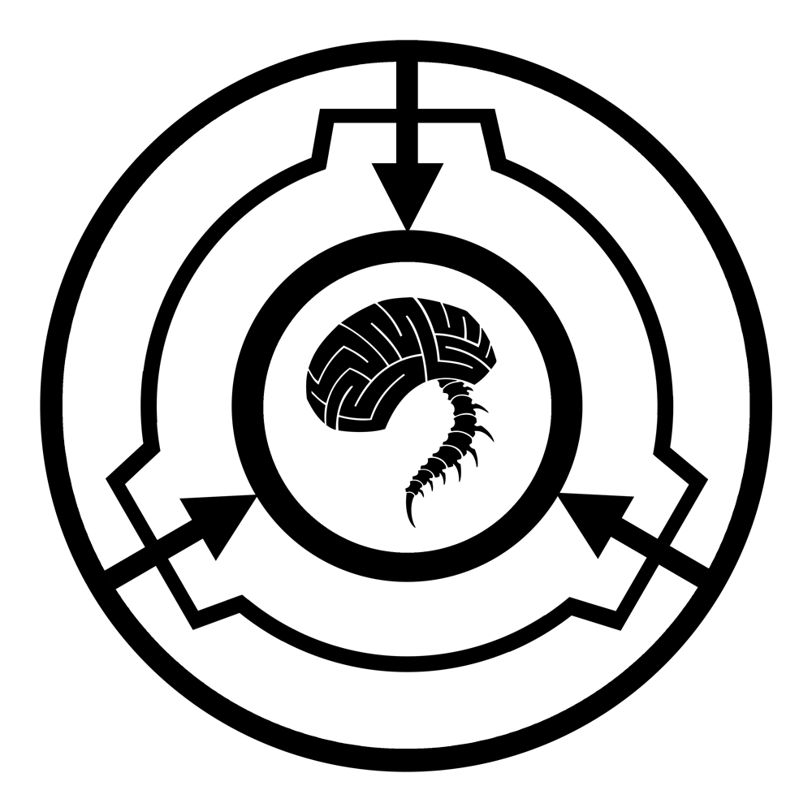

# SCP Terminal - SDDM Theme

A terminal-style SDDM login theme inspired by the SCP Foundation's Antimemetics Division, featuring CRT effects, glitch animations, and an unsettling aesthetic.



## Features

### Visual Effects
- **CRT Scanlines & Vignette**: Authentic old-monitor feel with shader-based scanlines
- **Rotating SCP Logo**: Smooth 6°/second rotation with red glow effect
- **Static/Noise Layer**: Dynamic noise with random intensity bursts
- **Screen Glitch/Jitter**: Occasional screen displacement and white flashes
- **Character Corruption**: Random glyph replacement in ambient text
- **Logo Flicker**: Intermittent opacity changes for unsettling effect

### UI Components
- **Two-Column Layout**: 
  - Left (40%): Branding, rotating logo, clearance display
  - Right (60%): Terminal interface, authentication, warnings
- **Terminal-Style Authentication**: Monospaced text inputs with blinking cursors
- **Boot Sequence Animation**: Sequential loading messages on startup
- **Ambient Text Cycling**: Rotating lore-inspired messages
- **Session Selector**: Desktop environment picker
- **Warning Banner**: Animated alerts and notices

### Accessibility
- **Safe Mode**: Press `Shift` to toggle all effects off for seizure safety
- **High Contrast**: Optimized color palette for readability
- **Keyboard Navigation**: Full keyboard support with Tab/Enter

## Installation

### System-wide Installation (Recommended)

1. Copy theme to SDDM themes directory:
```bash
sudo cp -r /path/to/scp_terminal /usr/share/sddm/themes/scp_terminal
```

2. Set as current theme by editing `/etc/sddm.conf` (or `/etc/sddm.conf.d/theme.conf`):
```ini
[Theme]
Current=scp_terminal
```

3. Restart SDDM:
```bash
sudo systemctl restart sddm
```

### User Installation (Development/Testing)

1. Copy theme to user themes directory:
```bash
mkdir -p ~/.local/share/sddm/themes
cp -r /path/to/scp_terminal ~/.local/share/sddm/themes/scp_terminal
```

2. Update SDDM configuration to point to user directory.

### Testing Without SDDM

Preview the theme using `sddm-greeter`:
```bash
sddm-greeter --test-mode --theme /path/to/scp_terminal
```

Or use `qmlscene` for rapid iteration:
```bash
qmlscene qml/Main.qml
```
*(Note: SDDM components won't be available, but you can test visuals)*

## Configuration

Edit `theme.conf` to customize:

```ini
# Enable/disable effects
enableEffects=true
enableScanlines=true
enableGlitch=true
enableNoise=true

# Animation speeds
rotationSpeed=6.0        # Logo rotation degrees per second
glitchInterval=15000     # Milliseconds between glitch effects
noiseInterval=5000       # Milliseconds between noise bursts

# Colors (hex format)
primaryColor=#8B0000     # Dark red
secondaryColor=#FF6B00   # Orange
backgroundColor=#000000  # Black
```

## Keyboard Shortcuts

- **Shift**: Toggle Safe Mode (disables all glitch/flicker effects)
- **Tab**: Cycle between username/password fields
- **Enter**: Submit authentication

## Project Structure

```
scp_terminal/
├── qml/
│   └── Main.qml              # Main QML greeter interface
├── assets/
│   ├── images/
│   │   └── scp_logo.png      # SCP Foundation logo
│   └── textures/             # Additional texture assets
├── fonts/                    # Custom fonts (optional)
├── sound/                    # Audio effects (future)
├── shaders/                  # Additional shader effects (future)
├── docs/                     # Additional documentation
├── metadata.desktop          # SDDM theme metadata
├── theme.conf                # Theme configuration
└── README.md                 # This file
```

## Technical Details

### QML Version
- Qt 5.15 / QtQuick 2.15
- QtGraphicalEffects 1.15
- SddmComponents 2.0

### Shaders
The theme uses custom GLSL fragment shaders for:
- Scanline effect with subtle vertical scrolling
- Vignette with smooth falloff
- Procedural noise generation

### Performance
- Optimized for 1080p/1440p displays
- Minimal CPU usage (~1-2%)
- GPU usage: <5% on modern hardware
- Safe for low-end systems (disable effects via safe mode)

## Customization

### Adding Your Own Content

Edit the arrays in `qml/Main.qml`:

```qml
readonly property var bootMessages: [
    "YOUR MESSAGE HERE",
    // Add more...
]

readonly property var ambientFragments: [
    "YOUR AMBIENT TEXT",
    // Add more...
]
```

### Changing Logo

Replace `assets/images/scp_logo.png` with your own image (PNG or SVG).
For best results, use a square aspect ratio (512x512 or higher).

### Adjusting Animation Timings

Modify the Timer intervals in `Main.qml`:
- Logo flicker: Line ~340 (default: 12000-30000ms)
- Screen glitch: Line ~248 (default: 8000-23000ms)
- Noise bursts: Line ~180 (default: 3000-10000ms)
- Character corruption: Line ~806 (default: 10000-20000ms)

## Theming Philosophy

This theme aims to capture the unsettling, liminal aesthetic of the SCP Foundation's Antimemetics Division:

1. **Subtle Over Overt**: Effects are rare and brief to maintain unease without being annoying
2. **Functional First**: All effects can be disabled; authentication always works
3. **Lore-Accurate**: Text content inspired by authentic SCP wiki antimemetic entries
4. **Terminal Aesthetic**: Monospaced fonts, command-line feel, green/red color scheme

## Troubleshooting

### Theme doesn't load
- Check SDDM logs: `journalctl -u sddm -b`
- Verify `metadata.desktop` is present
- Ensure QML path is correct in metadata

### Effects not working
- Verify your GPU supports GLSL shaders
- Check Qt version: `qmlscene --version`
- Try enabling safe mode and disabling effects one by one

### Authentication fails
- This is an SDDM/PAM issue, not theme-related
- Verify user credentials work on TTY first
- Check PAM logs: `/var/log/auth.log`

### Performance issues
- Enable safe mode (Shift key)
- Reduce animation intervals in theme.conf
- Disable shader effects by editing Main.qml

## Dependencies

### Required
- SDDM (>=0.18.0)
- Qt5 (>=5.15)
- QtQuick 2.15
- QtGraphicalEffects 1.15

### Optional (for testing)
- `qmlscene` (qt5-declarative package)
- `sddm-greeter` with test mode support

### Font Recommendations
The theme uses system monospace fonts by default. For enhanced aesthetics:
- **VT323** (authentic terminal feel)
- **IBM Plex Mono** (modern, readable)
- **Share Tech Mono** (sci-fi aesthetic)
- **Courier Prime** (classic typewriter)

Install via your package manager:
```bash
# Arch
sudo pacman -S ttf-ibm-plex ttf-share-tech-mono

# Debian/Ubuntu
sudo apt install fonts-ibm-plex fonts-share-tech-mono
```

## Roadmap

### Phase 1 ✓
- [x] Basic two-column layout
- [x] Terminal-style input fields
- [x] CRT shader effects
- [x] Logo rotation and glow
- [x] Glitch animations
- [x] Character corruption
- [x] Ambient text cycling
- [x] Safe mode toggle

### Phase 2 (Future)
- [ ] Sound effects (keypress beeps, ambient hum, static)
- [ ] Additional shader effects (chromatic aberration, barrel distortion)
- [ ] Custom glyph font for corruption
- [ ] Animated background particles
- [ ] Multi-monitor support enhancements

### Phase 3 (Advanced)
- [ ] Alternative "mnestic handshake" authentication sequence
- [ ] Biometric simulation effects
- [ ] Memory corruption visual metaphors
- [ ] Dynamic difficulty adjustment for effects

## Credits & License

**Created by**: Ghost Bot  
**Inspired by**: SCP Foundation Antimemetics Division by qntm  
**License**: Creative Commons Attribution-ShareAlike 4.0 (CC BY-SA 4.0)

### Third-Party Assets
- SCP Foundation logo: CC BY-SA 3.0 (Wikimedia Commons)
- Shader concepts: Various open-source CRT shader implementations

### Contributing
This is a reference implementation. Feel free to fork, modify, and share under CC BY-SA 4.0.

### Legal Notice
This theme is a fan creation inspired by the SCP Foundation collaborative fiction project. It is not officially affiliated with the SCP Foundation wiki or its contributors. All SCP-related content is licensed under CC BY-SA 3.0.

## Support

For issues, questions, or contributions:
- Check the troubleshooting section above
- Review SDDM documentation: https://github.com/sddm/sddm
- Test QML components independently with qmlscene

---

**"WE DIE IN THE DARK SO YOU CAN LIVE IN THE LIGHT"**

